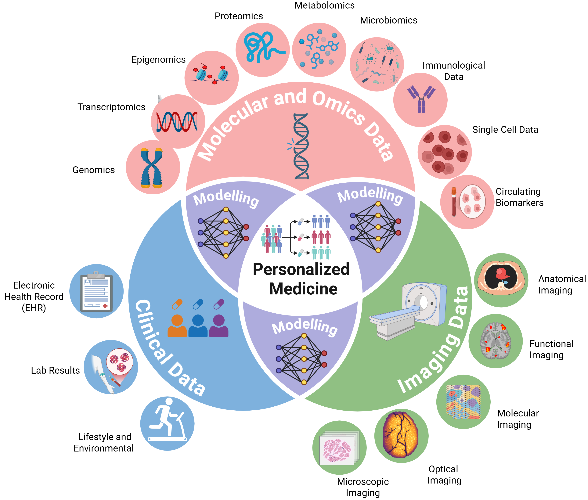
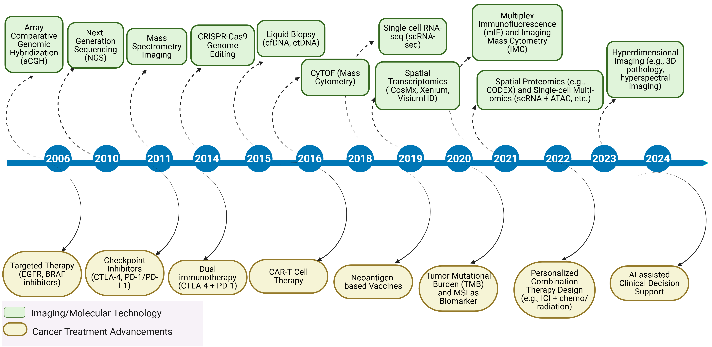
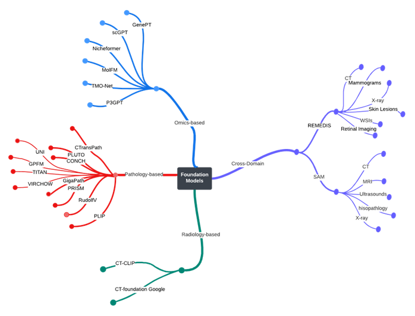

# From Classical Machine Learning to Emerging Foundation Models: Multimodal Data Integration for Cancer Research

<!-- [](https://arxiv.org/abs/PAPER_ID) -->
[](LICENSE)


> **Abstract**: Cancer research increasingly relies on integrating diverse data modalities, from genomics to imaging. Foundation models (FMs)—large pretrained deep-learning models—provide powerful new ways to discover biomarkers, enhance diagnosis, and personalize treatments. This review systematically examines multimodal integration strategies in oncology, highlighting the shift from traditional machine learning to advanced FMs. We identify state-of-the-art methods, resources, and challenges, laying essential groundwork for the next generation of large-scale AI models poised to revolutionize cancer research.


---

### 🎯 Key Contributions

This research offers several key contributions to the field of multimodal data integration in oncology. We provide a comprehensive examination of integration strategies, from classical machine learning techniques to emerging foundation models. By analyzing this transition, we offer insights into the evolution of computational approaches in cancer research. Our holistic view encompasses recent advancements and persistent challenges, particularly in integrating multi-omics data with advanced imaging. We identify state-of-the-art foundation models and curate a list of publicly available resources to support further research. Importantly, we argue that current integrative methods lay the essential groundwork for the next generation of large-scale AI models poised to revolutionize oncology. To our knowledge, this is the first review to systematically map this critical transition, framing it as foundational for the future of AI in cancer research.

- Comprehensive review of multimodal integration strategies in oncology
- Analysis of the shift from traditional machine learning to foundation models
- Holistic view of advancements and challenges in multi-omics and imaging integration
- Identification of state-of-the-art foundation models and public resources
- Argument for current methods as groundwork for future large-scale AI models
- First systematic mapping of the ML to FM transition in oncology


### 🧬 Technological Breakthroughs in Cancer Treatment

Following the exploration of deep learning advancements in multimodal cancer research, Figure 2.b highlights the transformative role of imaging and molecular technologies in advancing cancer treatment. These innovations have significantly enhanced our ability to diagnose, characterize, and treat cancer with greater precision, offering new hope for improved patient outcomes.

- **Advanced Imaging Modalities**: Cutting-edge developments in imaging technologies, such as positron emission tomography (PET), magnetic resonance imaging (MRI), and computed tomography (CT), have provided detailed visualizations of tumor structure and behavior, enabling earlier and more accurate detection.
- **Molecular Insights**: Breakthroughs in molecular technologies, including next-generation sequencing (NGS) and single-cell analysis, have revealed the intricate genetic and molecular profiles of tumors, facilitating the design of tailored therapeutic interventions.
- **Data Synergy**: The integration of imaging and molecular data has created a powerful framework for understanding cancer at multiple scales, fostering the development of novel treatment strategies that leverage this combined knowledge.
- **Therapeutic Impact**: These technological advancements have directly contributed to clinical success, with benefits including more effective targeted therapies, reduced treatment-related toxicities, and enhanced monitoring of disease progression.

Together, these breakthroughs underscore the critical role of technology in pushing the boundaries of cancer care. When paired with computational approaches like foundation models, they pave the way for even greater strides in personalized medicine and research innovation.




### 📖 Comprehensive Multi-Modal Data Repositories

A critical foundation for advancing multimodal data integration in cancer research lies in the availability of comprehensive, high-quality data repositories. These repositories provide researchers with access to diverse data types—such as genomics, proteomics, transcriptomics, metabolomics, imaging, and clinical metadata—enabling the development and validation of sophisticated machine learning and foundation models. Table 1 presents a curated list of key multi-modal data repositories that are widely used in oncology. These resources not only support the integration of heterogeneous data but also facilitate the discovery of novel biomarkers, the classification of cancer subtypes, and the personalization of treatment strategies. By leveraging these repositories, researchers can train and validate models that capture the full complexity of cancer biology, ultimately driving the next generation of AI-powered oncology tools.


| **Repository**            | **Description**                                                                 | **Data Types**                              | **Cancer Types**                              | **Website**                          |
|---------------------------|---------------------------------------------------------------------------------|---------------------------------------------|-----------------------------------------------|--------------------------------------|
| **The Cancer Genome Atlas (TCGA)** | A landmark cancer genomics program providing molecular characterization of over 20,000 primary cancer and matched normal samples. | Genomics, Transcriptomics, Epigenomics, Proteomics, Clinical metadata | Multiple (e.g., lung, breast, prostate, colorectal) | [TCGA](https://www.cancer.gov/tcga) |
| **Gene Expression Omnibus (GEO)** | A public repository for high-throughput gene expression and genomics data, including microarray and sequencing datasets. | Genomics, Transcriptomics                  | Various (e.g., breast, lung, leukemia, melanoma) | [GEO](https://www.ncbi.nlm.nih.gov/geo/) |
| **Human Protein Atlas (HPA)** | A comprehensive resource mapping the human proteome, including spatial proteomics and transcriptomics data for cancer tissues. | Proteomics, Transcriptomics, Spatial proteomics, Clinical survival data | Over 20 major cancers (e.g., breast, lung, colorectal, prostate) | [HPA](https://www.proteinatlas.org/) |
| **Metabolomics Workbench** | A repository for metabolomics data, including raw and processed datasets from various studies. | Metabolomics (LC-MS, GC-MS, NMR)           | Breast, lung, colorectal, prostate, ovarian, etc. | [Metabolomics Workbench](https://www.metabolomicsworkbench.org/) |
| **European Genome-Phenome Archive (EGA)** | A repository for genomic and phenotypic data, including multi-omics datasets for cancer research. | Genomics, Epigenomics, Clinical metadata   | Breast, colorectal, prostate, lung, hematologic malignancies | [EGA](https://ega-archive.org/) |
| **cBioPortal**            | A platform for exploring, visualizing, and analyzing multidimensional cancer genomics data. | Genomics, Transcriptomics, Clinical metadata | Multiple (e.g., breast, prostate, glioblastoma, leukemia) | [cBioPortal](https://www.cbioportal.org/) |
| **ProteomicsDB**          | A database for proteomics data, including cancer-focused proteomic profiles and drug-target interactions. | Proteomics                                 | Various (e.g., cancer-focused proteomic and PTM profiles) | [ProteomicsDB](https://www.proteomicsdb.org/) |
| **ENCODE (Encyclopedia of DNA Elements)** | A project providing functional annotations of the human genome, including data from cancer cell lines. | Genomics, Epigenomics                      | Breast, lung, colorectal, hematologic malignancies | [ENCODE](https://www.encodeproject.org/) |
| **Synapse (Sage Bionetworks)** | A collaborative platform for sharing and analyzing multi-omics data, including cancer datasets. | Genomics, Transcriptomics, Proteomics, Epigenomics, Clinical metadata | Diverse cancers (e.g., breast, lung, colorectal, prostate) | [Synapse](https://www.synapse.org/) |
| **MetaboLights**          | A database for metabolomics experiments and derived information, including cancer-related studies. | Metabolomics                               | Breast, lung, gastric, renal, liver, colorectal, prostate | [MetaboLights](https://www.ebi.ac.uk/metabolights/) |

---

### 💻 Multi-Omics Tools and Methods for Cancer Research

In the era of precision oncology, multi-omics tools and methods are essential for integrating and analyzing complex biological data from genomics, transcriptomics, proteomics, and other omics layers. These tools enable researchers to uncover hidden patterns, identify biomarkers, and develop predictive models that enhance cancer diagnosis, prognosis, and treatment. Table 2 presents a curated list of leading multi-omics tools and methods, categorized by their primary applications in disease subtyping, mechanistic and pathway analysis, and biomarker prediction. Each tool is accompanied by a brief description of its applications and a link to its official resource for further exploration. These resources are invaluable for advancing multimodal data integration and driving innovation in cancer research.

<div align="center">

<table>
  <thead>
    <tr>
      <th align="center">Category</th>
      <th align="center">Tool / Method</th>
      <th align="center">Applications</th>
    </tr>
  </thead>

  <!-- Disease Subtyping -->
  <tbody>
    <tr>
      <td align="center" rowspan="5"><strong>Disease&nbsp;Subtyping</strong></td>
      <td align="center"><a href="https://github.com/maxconway/SNFtool">SNFtool</a></td>
      <td align="center">Integrates multi-omics similarity networks to stratify patients into clinically meaningful subtypes.</td>
    </tr>
    <tr>
      <td align="center"><a href="https://bioconductor.org/packages/release/bioc/html/iClusterPlus.html">iClusterPlus</a></td>
      <td align="center">Integrative clustering of multiple omics data types for identifying disease subtypes and patient groups.</td>
    </tr>
    <tr>
      <td align="center"><a href="https://github.com/danro9685/CIMLR">CIMLR</a></td>
      <td align="center">Consensus clustering of multi-omics data to detect novel subtypes and improve patient stratification.</td>
    </tr>
    <tr>
      <td align="center"><a href="https://mixomics.org/">mixOmics</a></td>
      <td align="center">Multi-omics integration to identify molecular signatures and subtypes, aiding classification and interpretation.</td>
    </tr>
    <tr>
      <td align="center"><a href="https://github.com/bioFAM/MOFA2">MOFA2</a></td>
      <td align="center">Latent-factor modelling integrates multi-omics data, revealing shared and unique patterns for subtyping.</td>
    </tr>
  </tbody>

  <!-- Mechanistic & Pathway Analysis -->
  <tbody>
    <tr>
      <td align="center" rowspan="6"><strong>Mechanistic &<br>Pathway Analysis</strong></td>
      <td align="center"><a href="https://github.com/cbg-ethz/netics">NetICS</a></td>
      <td align="center">Network-based integration of multi-omics data to identify key pathways, drivers and interactions.</td>
    </tr>
    <tr>
      <td align="center"><a href="http://paradigm.five3genomics.com/">PARADIGM</a></td>
      <td align="center">Infers activity levels of biological pathways from integrated omics data for deeper functional insight.</td>
    </tr>
    <tr>
      <td align="center"><a href="https://github.com/PathwayAnalysisPlatform/PathwayMatcher">PathwayMatcher</a></td>
      <td align="center">Aligns omics data with known biological pathways for pathway-level interpretation and hypothesis testing.</td>
    </tr>
    <tr>
      <td align="center"><a href="https://www.bioconductor.org/packages/release/bioc/html/ReactomeGSA.html">ReactomeGSA</a></td>
      <td align="center">Comparative pathway analysis on multi-omics datasets, yielding insights into disease mechanisms.</td>
    </tr>
    <tr>
      <td align="center"><a href="https://github.com/thomazbastiaanssen/anansi">Anansi</a></td>
      <td align="center">Integrates multi-omics data with external knowledge bases for enhanced interpretability and mechanistic insight.</td>
    </tr>
    <tr>
      <td align="center"><a href="https://github.com/bioFAM/MOFA2">MOFA2</a></td>
      <td align="center">Identifies underlying factors across multiple data layers, providing a systems-level view of disease.</td>
    </tr>
  </tbody>

  <!-- Biomarker Prediction -->
  <tbody>
    <tr>
      <td align="center" rowspan="5"><strong>Biomarker&nbsp;Prediction</strong></td>
      <td align="center"><a href="http://csbi.ltdk.helsinki.fi/CNAmet">CNAmet</a></td>
      <td align="center">Correlates genomic and metabolic alterations to discover potential diagnostic/prognostic biomarkers.</td>
    </tr>
    <tr>
      <td align="center"><a href="https://github.com/selbouhaddani/OmicsPLS">OmicsPLS</a></td>
      <td align="center">Models joint and unique variation between two omics datasets to identify predictive biomarkers.</td>
    </tr>
    <tr>
      <td align="center"><a href="https://mixomics.org/mixmint/">MINT</a></td>
      <td align="center">Integrates multi-omics data across cohorts, enhancing biomarker robustness and generalisation.</td>
    </tr>
    <tr>
      <td align="center"><a href="https://github.com/HakimBenkirane/CustOmics">CustOmics</a></td>
      <td align="center">Deep-learning framework for classification and survival analysis, ensuring robust biomarker discovery.</td>
    </tr>
    <tr>
      <td align="center"><a href="https://github.com/immunogenomics/harmony">Harmony</a></td>
      <td align="center">Resolves batch effects in multi-omics data, improving consistency and enabling biomarker discovery.</td>
    </tr>
  </tbody>
</table>

</div>

---

### 📚 Taxonomy of Foundation Models in Multimodal Cancer Research

A clear conceptual map helps position existing work and guide future model design.  
Figure below groups today’s foundation models into four complementary domains:

1. **Omics FMs** – large language/transformer models trained on genomic, transcriptomic, or single-cell data (e.g., MO-Net, MolFM, scGPT, GenePT, Path-GPTOmic).  
2. **Pathology FMs** – vision or vision-language backbones for WSI tiles (e.g., UNI, PLUTO, CTransPath, GigaPath).  
3. **Radiology FMs** – volumetric vision models for CT/MRI/PET (e.g., SAM-Med, CT-CLIP, Google CT-FM).  
4. **Cross-Domain Integrative FMs** – architectures explicitly built to ingest and align two + modalities (e.g., SAM, REMEDIS).




## Citation
If you use this framework, please cite our work:

```bibtex
@misc{muneer2025classicalmachinelearningemerging,
      title={From Classical Machine Learning to Emerging Foundation Models: Review on Multimodal Data Integration for Cancer Research}, 
      author={Amgad Muneer and Muhammad Waqas and Maliazurina B Saad and Eman Showkatian and Rukhmini Bandyopadhyay and Hui Xu and Wentao Li and Joe Y Chang and Zhongxing Liao and Cara Haymaker and Luisa Solis Soto and Carol C Wu and Natalie I Vokes and Xiuning Le and Lauren A Byers and Don L Gibbons and John V Heymach and Jianjun Zhang and Jia Wu},
      year={2025},
      eprint={2507.09028},
      archivePrefix={arXiv},
      primaryClass={q-bio.QM},
      url={https://arxiv.org/abs/2507.09028}, 
}
```
