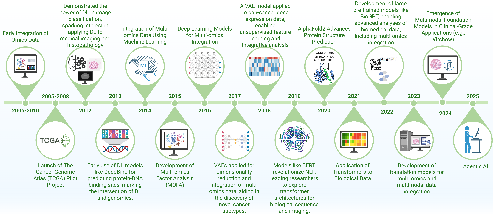

# From Classical Machine Learning to Emerging Foundation Models: Multimodal Data Integration for Cancer Research

<!-- [](https://arxiv.org/abs/PAPER_ID) -->
[](LICENSE)


> **Abstract**: Cancer research increasingly relies on integrating diverse data modalities, from genomics to imaging. Foundation models (FMs)—large pretrained deep-learning models—provide powerful new ways to discover biomarkers, enhance diagnosis, and personalize treatments. This review systematically examines multimodal integration strategies in oncology, highlighting the shift from traditional machine learning to advanced FMs. We identify state-of-the-art methods, resources, and challenges, laying essential groundwork for the next generation of large-scale AI models poised to revolutionize cancer research.


---

### 🎯 Key Contributions

This review makes several key contributions to the field of multimodal data integration in oncology. We provide a comprehensive examination of integration strategies, spanning from classical machine learning techniques to emerging foundation models. By analyzing this transition, we offer insights into the evolution of computational approaches in cancer research. Our holistic view encompasses recent advancements and persistent challenges, particularly in integrating multi-omics data with advanced imaging. We identify state-of-the-art foundation models and curate a list of publicly available resources to support further research. Importantly, we argue that current integrative methods lay the essential groundwork for the next generation of large-scale AI models poised to revolutionize oncology. To our knowledge, this is the first review to systematically map this critical transition, framing it as foundational for the future of AI in cancer research.

- Comprehensive review of multimodal integration strategies in oncology
- Analysis of the shift from traditional machine learning to foundation models
- Holistic view of advancements and challenges in multi-omics and imaging integration
- Identification of state-of-the-art foundation models and public resources
- Argument for current methods as groundwork for future large-scale AI models
- First systematic mapping of the ML to FM transition in oncology




## Citation
If you use this framework, please cite our work:

```bibtex
@article{muneer2025multimodal,
  title  = {From Classical Machine Learning to Emerging Foundation Models: Review on Multimodal Data Integration for Cancer Research},
  author = {Muneer, Amgad and Waqas, Muhammad and Saad, Maliazurina B. and Showkatian, Eman and et al.},
  journal= {},
  year   = {},
  note   = {}
}
```